# Plan de Trabajo Terminal: Metodología Komorebi (Graphito)

Este documento formaliza el plan de desarrollo, experimentación y redacción técnica para el sistema **Graphito**, alineando el cronograma de Trabajo Terminal con el ciclo de vida de modelos de inteligencia artificial bajo la **Metodología Komorebi**.

---

## 1. Mapeo General: Cronograma vs. Fases Komorebi

```mermaid
flowchart TD
    subgraph F1["Fase 1: Planificación (TT-1)"]
        P1["Investigación de literatura"]
        P2["Requerimientos y Reglas de Negocio"]
        P3["Diseño C4 y BPMN"]
    end

    subgraph F2["Fase 2: Adquisición de Datos"]
        D1["Dataset IEEE (Humano)"]
        D2["Ingeniería Inversa (Enunciados LLM)"]
        D3["Generación Sintética (Clase IA)"]
    end

    subgraph F3["Fase 3: Preparación de Datos"]
        PR1["Bifurcación: Raw vs Normalizado"]
        PR2["Extracción AST / DFG"]
        PR3["Mapeo a Caracteres 1D"]
        PR4["Partición por problema (Leakage-free)"]
    end

    subgraph F4["Fase 4: Entrenamiento y Modelado"]
        M1["Canal A: GraphCodeBERT (Embeddings 768d)"]
        M2["Canal B: CharCNN (Probabilidad IA 1d)"]
        M3["Fusión de Características (Vector 769d)"]
    end

    subgraph F5["Fase 5: Evaluación y Validación"]
        E1["Métricas de clasificación (F1, ROC-AUC)"]
        E2["Similitud Coseno de Clones Bellon"]
        E3["Benchmark de Arquetipos de Alumnos"]
    end

    subgraph F6["Fase 6: Despliegue de Modelos"]
        S1["Backend FastAPI (Clean Architecture)"]
        S2["Persistencia Dual: PostgreSQL + ChromaDB"]
        S3["Frontend React + Tailwind (Dashboard Docente)"]
    end

    subgraph F7["Fase 7: Monitorización y Cierre"]
        MO1["Pruebas Unitarias y de Robustez"]
        MO2["Calibración de Umbrales (< 10% FP)"]
        MO3["Manual de Usuario y Reporte Final"]
    end

    F1 --> F2
    F2 --> F3
    F3 --> F4
    F4 --> F5
    F5 --> F6
    F6 --> F7
```

---

## 2. Desglose Detallado por Fase

### Fase 1: Planificación del Proyecto y Comprensión del Negocio
* **Objetivo:** Establecer las bases pedagógicas, teóricas y de ingeniería de software que justifican la creación de Graphito.
* **Aspectos a documentar y desarrollar:**
  - **Contexto y Problemática:** La crisis de evaluación en programación introductoria ante herramientas generativas (ChatGPT, Claude, Copilot); limitaciones de la revisión manual en grupos masivos.
  - **Estado del Arte:** Análisis comparativo de herramientas léxicas/textuales (*MOSS*), sintácticas (*JPlag*), jueces automáticos (*Gradescope, CodeGrade*) y modelos de lenguaje para código (*CodeBERT, UniXcoder*).
  - **Especificación de Requerimientos:**
    - *Funcionales:* RF-01 a RF-12 (gestión de biblioteca, carga de código, preprocesamiento dual, generación de variantes por LLM, cálculo de similitud del coseno y persistencia híbrida).
    - *No Funcionales:* RNF-01 a RNF-11 (tiempos de inferencia < 20s, compatibilidad C11/C++17, F1-Score $\ge 0.85$, precisión de autoría $\ge 0.80$, tasa de falsos positivos $< 10\%$).
    - *Reglas de Negocio:* RN-01 a RN-06 (principio *Human-in-the-loop*, privacidad de evaluaciones por docente, no contaminación de referencias).
  - **Modelado de Procesos y Casos de Uso:** Casos de uso UC1 a UC12 y modelado BPMN 2.0 del flujo de auditoría académica.

---

### Fase 2: Adquisición de Datos (*Data Ingestion*)
* **Objetivo:** Recolectar y construir un conjunto de datos híbrido, balanceado y representativo de programación introductoria.
* **Aspectos a documentar y desarrollar:**
  - **Código Humano (IEEE Programming Homework Dataset):** 
    - Composición: 4 cursos universitarios reales (A2016, A2017, B2016, B2017), ~100-150 alumnos por cohorte, 16 a 22 asignaciones en C y C++.
  - **Ingeniería Inversa de Enunciados:**
    - Problema metodológico: El dataset no incluía las especificaciones de los problemas.
    - Solución técnica: Script `extraer_enunciados.py` con LLMs para deducir las reglas de negocio de los problemas a partir del código de los alumnos, consolidando `enunciados.csv`.
  - **Generación de la Clase Sintética (IA):**
    - Múltiples proveedores mediante `generar_referencias.py`: APIs comerciales (OpenAI, Anthropic) y modelos abiertos locales (Ollama con DeepSeek y Qwen2.5).
    - Control de sesgo lingüístico: Prompts diseñados para preservar el idioma base (serbocroata/inglés técnico), obligando a los modelos a aprender características de formato y sintaxis, no diferencias léxicas idiomáticas.

---

### Fase 3: Preparación y Preprocesamiento de Datos
* **Objetivo:** Transformar el código fuente en representaciones procesables para los dos canales de análisis sin inducir fuga de información.
* **Aspectos a documentar y desarrollar:**
  - **Bifurcación de Datos:**
    - *Canal Semántico:* Eliminación de comentarios, espacios redundantes, normalización de identificadores, generación del AST y extracción del Grafo de Flujo de Datos (DFG) con `models/graphcodebert/parser.py`.
    - *Canal Estilométrico:* Preservación estricta de código *raw* (indentación, espaciado, estilo de llaves, comentarios, acentuación).
  - **Cuantización de Caracteres:** Conversión de texto en bruto a matrices unidimensionales sobre un alfabeto predefinido de 97 caracteres para convoluciones 1D.
  - **Partición por Problema (*Leakage-Free Split*):**
    - 70% Entrenamiento (14,000 muestras).
    - 15% Validación (3,000 muestras).
    - 15% Prueba (3,000 muestras).
    - Garantía: Todas las soluciones de un problema $P_i$ residen en un solo conjunto, asegurando que la evaluación mida generalización y no memorización.

---

### Fase 4: Entrenamiento y Modelado de IA
* **Objetivo:** Configurar y optimizar las arquitecturas neuronales de doble canal.
* **Aspectos a documentar y desarrollar:**
  - **Canal Semántico (GraphCodeBERT):**
    - Mecanismo de autoatención enriquecido con matrices de adyacencia de variables.
    - Generación de embeddings densos de $768$ dimensiones.
    - Aplicación de adaptador LoRA (`adaptador-lora-20k`) para ajustar la representación al dominio de ejercicios académicos.
  - **Canal Estilométrico (CharCNN):**
    - Red convolucional 1D inspirada en Zhang et al. (2015), capaz de leer patrones de estilo visuales.
    - Hiperparámetros de entrenamiento: tamaños de kernel (3, 5, 7), capas de pooling, dropout de 0.5, función de pérdida *Binary Cross Entropy*.
    - Guardado de mejores pesos en `models/char_cnn/best_model.pth`.
  - **Fusión de Características (*Feature Fusion*):**
    - Concatenación del vector lógico ($d=768$) con el escalar estilométrico ($d=1$) $\to$ vector de $769$ dimensiones.
    - Técnica de *zero-padding* en la dimensión estilométrica para códigos de referencia oficiales.

---

### Fase 5: Evaluación y Validación Experimental
* **Objetivo:** Cuantificar el desempeño del sistema con rigor estadístico y evaluar casos reales de uso académico.
* **Aspectos a documentar y desarrollar:**
  - **Validación del Clasificador CharCNN:**
    - Matriz de confusión sobre el conjunto *Test* (3,000 muestras no vistas).
    - Métricas: Exactitud (*Accuracy*), Precisión, *Recall*, $F_1\text{-Score}$ y curva ROC-AUC.
  - **Sensibilidad y Robustez Semántica:**
    - Comprobación de invariancia de la similitud del coseno ante clones Tipo I (espacios), Tipo II (renombrado de variables) y Tipo III (reordenamiento de código).
    - Capacidad de captura de clones Tipo IV (bucles vs. recursión).
  - **Benchmark de Arquetipos de Alumnos (`benchmark_archetypes_results.json`):**
    - *Arquetipo 1: Alumno IA Puro* (alta similitud semántica + 99.5% probabilidad sintética $\to$ Alerta de auditoría).
    - *Arquetipo 2: Alumno Aplicado* (alta similitud semántica + código limpio humano).
    - *Arquetipo 3: Alumno con Malas Prácticas* (código espagueti, estilo descuidado pero autoría genuina).

---

### Fase 6: Despliegue e Integración de Software
* **Objetivo:** Construir una plataforma de software modular, escalable y mantenible.
* **Aspectos a documentar y desarrollar:**
  - **Arquitectura de Software (Modelo C4):**
    - *Nivel 1 (Contexto):* Docente, Graphito, LLMs externos.
    - *Nivel 2 (Contenedores):* SPA React, API REST FastAPI, PostgreSQL, ChromaDB.
    - *Nivel 3 (Componentes):* Orquestador, Preprocesador, Inferencia IA, Gestor de persistencia.
    - *Nivel 4 (Clases y Secuencia):* Patrón *Strategy* en `ModeloIA`, `FirmaDual`, `GestorPostgreSQL` y `GestorChromaDB`.
  - **Backend (`backend/app/`):**
    - Implementación de arquitectura limpia (*Domain, Application, Infrastructure, Presentation*).
    - Endpoints asíncronos para indexación de referencias y análisis de entregas.
  - **Bases de Datos Híbridas:**
    - *PostgreSQL:* Tablas `DOCENTE`, `PROBLEMA`, `CODIGO_FUENTE`, `REPORTE_ANALISIS`, `INDICADOR_INTEGRIDAD`.
    - *ChromaDB:* Colección vectorial `codigos_referencia` con metadata indexada (`problema_id`, `lenguaje`).
  - **Frontend (`frontend/`):**
    - Implementación en Vite + React + TypeScript + Tailwind CSS.
    - Diseño UI/UX en modo oscuro con *glassmorphism*.
    - Visualización de reportes con círculos de progreso de similitud lógica vs. estilométrica.

---

### Fase 7: Monitorización, Robustez y Trabajo Futuro
* **Objetivo:** Garantizar la estabilidad operativa y el valor pedagógico continuo.
* **Aspectos a documentar y desarrollar:**
  - **Pruebas Automatizadas:**
    - Pruebas unitarias de parsers AST/DFG (`tests/test_dfg_parser.py`).
    - Pruebas de robustez estilométrica ante perturbaciones (`tests/test_char_cnn_robustness.py`).
    - Pruebas end-to-end (`tests/test_e2e_analysis.py`).
  - **Calibración de Umbrales:** Control empírico de umbrales para evitar falsos positivos acusatorios ($< 10\%$).
  - **Manual de Usuario:** Flujo paso a paso para docentes (creación de ejercicio, carga de referencia, parametrización de variantes, carga de entregas y lectura de dictámenes).
  - **Conclusiones y Trabajo Futuro (TT-2):**
    - Integración en ambientes de producción de ESCOM-IPN.
    - Extensión a otros lenguajes de programación (Java, Python).
    - Despliegue en contenedores orquestados con Docker Compose.
