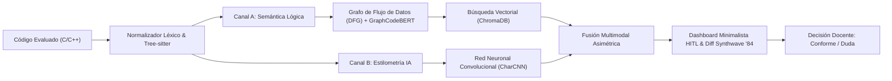

<div align="center">
  <h1 align="center">🔍 Graphito</h1>
  <h3>Sistema de Apoyo a la Decisión Docente para Integridad Académica en C/C++</h3>
  <p>Evaluación bimodal de código mediante Grafos de Flujo de Datos (DFG) y Estilometría con Deep Learning</p>
</div>

<br/>

**Graphito** es una plataforma pericial basada en el principio ético **Human-in-the-Loop (HITL)**, diseñada para asistir a los profesores en la evaluación de la autoría e integridad de soluciones de software en lenguajes C y C++. 

A diferencia de los verificadores tradicionales basados únicamente en cadenas de texto o árboles sintácticos rígidos, Graphito implementa una **arquitectura de análisis bimodal asimétrica** que examina simultáneamente la lógica algorítmica profunda y la huella estilométrica generativa.

---

## 🚀 Arquitectura de Análisis Bimodal



1. 🧠 **Canal A (Semántica Algorítmica):**
   - Extrae el Grafo de Flujo de Datos (**DFG**) con *Tree-sitter*, capturando el flujo de valores entre variables a través de ciclos y condicionales.
   - Aplica **GraphCodeBERT** optimizado con adaptadores **LoRA** (`adaptador-lora-20k`) para garantizar invarianza ante renombramiento de variables y reordenamiento de bloques.
2. ✍️ **Canal B (Estilometría y Detección de Sintaxis de LLMs):**
   - Implementa una arquitectura **CharCNN** (Convolutional Neural Network a nivel de caracteres) que analiza la cadencia sintáctica, regularidad léxica y patrones estilométricos característicos de modelos generativos (como ChatGPT, Claude o Copilot).
3. ⚖️ **Fusión Multimodal y Penalización por Discrepancia:**
   - Si un código presenta una similitud semántica alta con una solución canónica pero una probabilidad de estilo de IA significativa, el sistema calcula un **Índice de Discrepancia Asimétrica** que alerta al docente sobre una posible reelaboración sintética.

---

## ✨ Características Principales

- 💻 **Visualizador Diff Side-by-Side con Tema Synthwave '84:** Cotejo en pantalla completa (expandible al 94%-98% del viewport) del código del alumno contra la solución de referencia o soluciones previas.
- 💬 **Anotaciones Pedagógicas en Línea:** Posibilidad de registrar observaciones vinculadas a líneas concretas o notas generales, persistidas en base de datos.
- ⚡ **Dashboard Pericial Ejecutivo (Hero HUD):** Métricas clave en gran formato numérico (`Similitud Global`, `Semántica DFG`, `Estilometría IA`, `Discrepancia`), eliminando ruido visual y gráficos pesados.
- 🏷️ **Triaje Docente Rápido:** Calificación ágil de entregas con atajos de teclado (`A` para *Conforme*, `R` para *Citar a Aclaración / Duda*) y reflejo reactivo inmediato en la lista de tareas.
- 🖨️ **Dictamen Pericial Oficial (PDF & `@media print`):** Exportación institucional generada por el backend (ReportLab) e impresión directa en navegador, incluyendo código fuente evaluado con numeración de líneas y observaciones docentes.
- 🌙 **Sistema de Diseño Ergonómico:** Scrollbars oscuros personalizados, transiciones cinemáticas fluidas con GSAP y soporte para modos visuales.

---

## 🛠️ Stack Tecnológico

| Capa | Tecnologías |
| :--- | :--- |
| **Frontend** | React 18, TypeScript, Vite, Tailwind CSS, GSAP, Lucide Icons |
| **Backend API** | FastAPI, Python 3.11+, SQLAlchemy 2.0 (Asíncrono), Pydantic v2 |
| **Inteligencia Artificial** | PyTorch, HuggingFace Transformers (GraphCodeBERT), CharCNN, Tree-sitter |
| **Persistencia** | PostgreSQL (Metadatos relacionales), ChromaDB (Embeddings vectoriales) |
| **Documentación & Reportes** | LaTeX (IEEEtran), ReportLab (PDF Engine) |

---

## 📂 Estructura General del Repositorio

```plaintext
graphito/
├── frontend/               # Aplicación cliente web (React + Vite + Tailwind)
│   ├── src/components/     # SideBySideDiffViewer, SynthwaveHighlighter, ReferenceCard
│   ├── src/pages/          # Biblioteca, SimilarityReportModal
│   └── README.md           # Guía de arquitectura del frontend
├── backend/                # Servicio REST y motor analítico (FastAPI + Clean Architecture)
│   ├── app/domain/         # Entidades puras y puertos (InferencePort, VectorStorePort)
│   ├── app/application/    # Orquestador pericial S1-S7 y generación de PDF
│   ├── app/infrastructure/ # SQLAlchemy, adaptadores de inferencia y ChromaDB
│   ├── app/presentation/   # Endpoints de API v1, esquemas y dependencias
│   └── README.md           # Guía técnica del backend
├── models/                 # Modelos de Machine Learning e inferencia
│   ├── graphcodebert/      # Parser DFG y adaptador LoRA para Canal A
│   ├── char_cnn/           # Modelo convolucional a nivel de caracteres para Canal B
│   └── fusion.py           # Algoritmo de combinación y cálculo de discrepancia
├── data/                   # Pipeline de generación sintética y datasets
├── Documentacion/          # Documentación formal de Trabajo Terminal y guías
│   ├── Documento/          # Proyecto LaTeX compilable (capítulos, figuras, main.tex)
│   ├── guias_implementacion/ # 10 guías maestras de diseño e implementación
│   └── PLAN_METODOLOGIA_KOMOREBI.md
├── tests/                  # Suite de pruebas automatizadas con Pytest
├── docker-compose.yml      # Despliegue orquestado con contenedores
└── README.md               # Este documento
```

---

## ⚙️ Instalación y Puesta en Marcha

### Prerrequisitos
- **Git**
- **Docker** y **Docker Compose** (recomendado para entorno completo)
- O en su defecto: **Python 3.11+**, **Node.js 18+**, **PostgreSQL** y **ChromaDB**.

### Opción A: Despliegue con Docker Compose (Recomendado)

```bash
# 1. Clonar el repositorio
git clone https://github.com/SirDaarick/Graphito.git
cd Graphito

# 2. Configurar variables de entorno
cp .env.example .env  # Ajustar credenciales según sea necesario

# 3. Levantar servicios
docker-compose up --build
```
- Frontend: `http://localhost:5173`
- Backend Swagger Docs: `http://localhost:8000/docs`

### Opción B: Ejecución Local por Módulos

#### Backend:
```bash
cd backend
python -m venv venv
# Activar entorno (Windows: venv\Scripts\activate | Linux/Mac: source venv/bin/activate)
pip install -r requirements.txt
uvicorn app.main:app --reload --port 8000
```

#### Frontend:
```bash
cd frontend
npm install
npm run dev
```

---

## 🧪 Pruebas y Validación

```bash
# Ejecutar suite de pruebas de backend e inferencia
pytest tests/ backend/tests/ -v

# Validar compilación de producción del frontend
cd frontend && npm run build
```

---

## 👥 Autores y Dirección

- **Erick Daniel García Rodríguez**
- **Claudia Emilia Sánchez García**

**Directores de Trabajo Terminal:**
- **M. en C. Manuel Portillo Cedillo**
- **M. en C. Maribel Aragón García**

---

<p align="center">
  <i>Trabajo Terminal desarrollado en la <b>Escuela Superior de Cómputo (ESCOM)</b> del <b>Instituto Politécnico Nacional (IPN)</b>.</i>
</p>