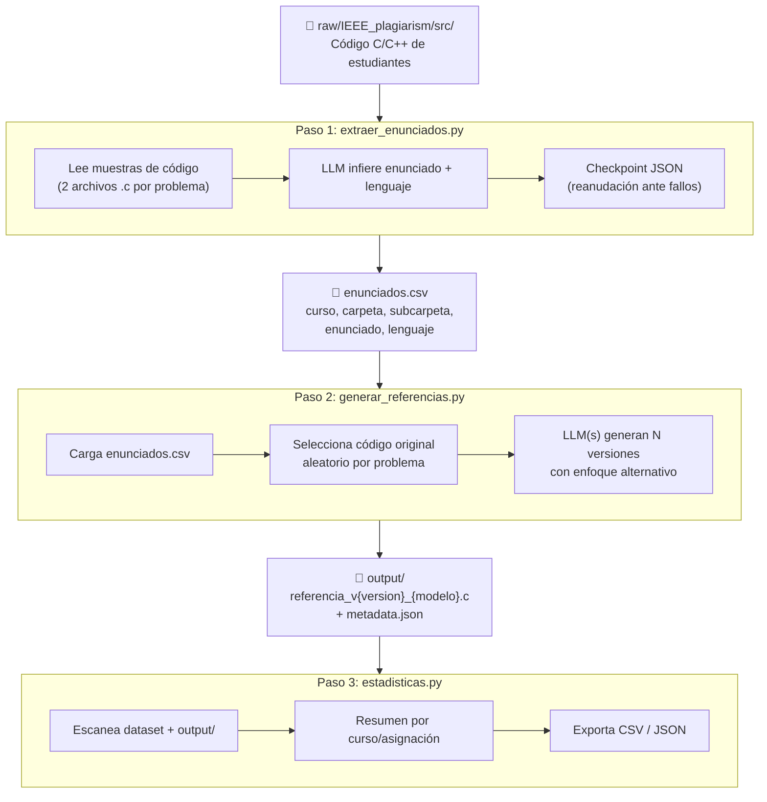
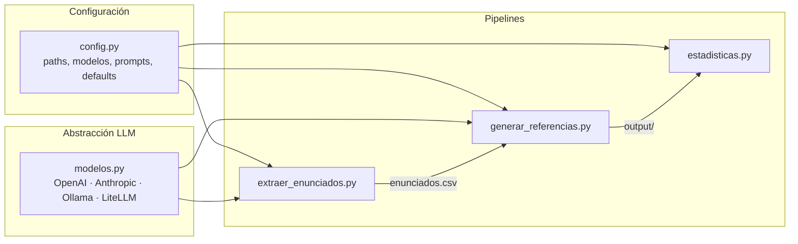

# Reporte del Pipeline de Enriquecimiento del Dataset IEEE Plagiarism

## Objetivo

Enriquecer el dataset de plagio académico IEEE Plagiarism (código C/C++ de estudiantes) generando versiones alternativas de código mediante LLMs. El pipeline infiere los enunciados de los problemas, genera referencias de código funcionalmente equivalente con distintos enfoques de implementación, y exporta estadísticas para su análisis.

---

## Stack Tecnológico

| Capa | Tecnología | Versión / Detalle |
|------|-----------|-------------------|
| **Lenguaje** | Python | 3.11 |
| **LLM Providers** | OpenAI, Anthropic, Ollama, LiteLLM | GPT-4o, Claude 3, Llama 3, Mistral, CodeLlama, Gemini |
| **Librerías Python** | `openai`, `anthropic`, `requests`, `litellm`, `python-dotenv`, `pandas` | — |
| **Contenedorización** | Docker | `python:3.11-slim` + `build-essential`, `gcc`, `g++` |

### Proveedores LLM

| Provider | Modelos Soportados | API |
|----------|-------------------|-----|
| **OpenAI** | `gpt-4o-mini`, `gpt-4o`, `gpt-4-turbo` | OpenAI API |
| **Anthropic** | `claude-3-haiku`, `claude-3-sonnet`, `claude-3-opus` | Anthropic API |
| **Ollama** (local) | `codellama`, `llama3`, `mistral` | `http://localhost:11434` |
| **LiteLLM** | `gemini-1.5-flash`, `gemini-1.5-pro`, `gemini-3.1-flash-lite-preview` | LiteLLM (unified API) |

### Variables de Entorno

| Variable | Descripción |
|----------|-------------|
| `OPENAI_API_KEY` | API key de OpenAI |
| `ANTHROPIC_API_KEY` | API key de Anthropic |
| `GOOGLE_API_KEY` | API key de Google (Gemini) |
| `OLLAMA_BASE_URL` | URL base de Ollama (default: `http://localhost:11434`) |

---

## Estructura del Dataset

El dataset se encuentra en `data/raw/IEEE_plagiarism/` y proviene de cursos de programación en C/C++.

### Directorio General

```
IEEE_plagiarism/
├── readme.txt                   # Documentación original
├── ground-truth-anon.txt         # Ground truth completo (estático + dinámico)
├── ground-truth-static-anon.txt  # Similitud de código
├── ground-truth-dynamic-anon.txt # Defensa oral fallida
├── src/                          # Códigos fuente de estudiantes
│   ├── A2016/  ─── Z1/ ─── Z1/ ─── studentXXXX.c
│   ├── A2017/  ─── Z2/ ─── Z2/ ─── studentXXXX.cpp
│   ├── B2016/  ─── ... ─── ...
│   └── B2017/
└── stats/                        # Rastros de uso del IDE (JSON)
    ├── A2016/
    ├── A2017/
    ├── B2016/
    └── B2017/
```

### Dimensiones del Dataset

| Dimensión | Valor |
|-----------|-------|
| Cursos | 4 (A2016, A2017, B2016, B2017) |
| Lenguaje | C / C++ |
| Estudiantes por curso | ~100-150 |
| Asignaciones por curso | 16-22 |
| Formato de trazas | JSON (eventos del IDE) |
| Anonimización | Nombres → `student{id}` |

### Ground Truth

| Archivo | Contenido |
|---------|-----------|
| `ground-truth-anon.txt` | Plagio total (código + defensa oral) |
| `ground-truth-static-anon.txt` | Solo similitud de código |
| `ground-truth-dynamic-anon.txt` | Solo fallo en defensa oral |

Formato: grupos de estudiantes separados por coma indican plagio mutuo.

### Rastros del IDE (`stats/`)

Cada archivo JSON contiene eventos del IDE por carpeta de asignación:

| Campo | Tipo | Descripción |
|-------|------|-------------|
| `total_time` | int | Tiempo trabajando (segundos) |
| `builds` | int | Intentos de compilación |
| `builds_succeeded` | int | Compilaciones exitosas |
| `testings` | int | Ejecuciones de tests |
| `last_test_results` | string | Formato `"X/Y"` |
| `events` | array | Eventos de cambio de código |
| `entries` | array | Archivos/carpetas en el directorio |

---

## Diagrama de Flujo del Pipeline



### Relación entre módulos



---

## Paso 1: Extraer Enunciados (`extraer_enunciados.py`)

Infiere el enunciado original de cada problema analizando 2 muestras de código de estudiantes mediante un LLM.

### Prompt utilizado

```
Analiza estos códigos de estudiantes que resuelven el mismo problema.
Infiere cuál es el enunciado/tarea original basándote en el código.
Solo responde con el enunciado inferido y el lenguaje de programación.

Código 1:
<primeros 2000 caracteres del código>

Código 2:
<primeros 2000 caracteres del código>

Responde en formato: "Enunciado: X | Lenguaje: Y"
```

### Parámetros

| Parámetro | Descripción | Default |
|-----------|-------------|---------|
| `--model` | Modelo LLM a usar | `gpt-4o-mini` |
| `--output` | Archivo CSV de salida | `enunciados.csv` |
| `--num-samples` | Muestras de código por problema | `2` |
| `--force` | Sobrescribir archivo existente | `false` |

### Formato de salida (`enunciados.csv`)

```csv
curso,carpeta,subcarpeta,enunciado,lenguaje
A2016,Z1,Z1,"Ordenamiento burbuja",C
A2016,Z1,Z2,"Buscar máximo en arreglo",C
A2016,Z2,Z1,"Lista enlazada",C
...
```

### Mecanismos de resiliencia

- **Checkpoint automático**: cada problema procesado se guarda en `extraer_enunciados_checkpoint.json`
- **Reanudación**: si el script se interrumpe, retoma desde el último problema completado
- **Retry con backoff exponencial**: hasta 5 reintentos con delay `30s × 2^n` ante errores de rate limit (429, 503, etc.)
- **Truncado de código**: cada muestra se limita a 2000 caracteres para no exceder la ventana de contexto

---

## Paso 2: Generar Referencias (`generar_referencias.py`)

Genera versiones de código funcionalmente equivalente pero con *distinto enfoque de implementación*, usando uno o varios LLMs.

### Prompt utilizado

```
Given this problem description: "{enunciado}"
And this original solution:
```c
{codigo_original}
```

Generate a functionally equivalent code but with a DIFFERENT implementation approach.
Do NOT copy the logic directly - use alternative algorithms where possible.
The output should be clean, compilable C code.
```

### Parámetros

| Parámetro | Descripción | Default |
|-----------|-------------|---------|
| `--model` | Modelo LLM único | `gpt-4o-mini` |
| `--models` | Lista de modelos a usar | — |
| `--versions` | Versiones por problema | `3` |
| `--enunciados` | Archivo CSV de enunciados | `enunciados.csv` |
| `--limit` | Limitar a N problemas (pruebas) | ilimitado |
| `--verbose` | Mostrar salida detallada | `false` |

### Estructura de salida

```
output/
├── A2016/
│   └── Z1/
│       └── Z1/
│           ├── referencia_v1_gpt-4o-mini.c
│           ├── referencia_v2_gpt-4o-mini.c
│           ├── referencia_v3_gpt-4o-mini.c
│           ├── referencia_v1_claude-3-haiku.c
│           ├── referencia_v2_claude-3-haiku.c
│           ├── referencia_v3_claude-3-haiku.c
│           └── metadata.json
└── ...
```

### Metadatos (`metadata.json`)

```json
{
  "references": [
    {
      "asignacion": "A2016/Z1/Z1",
      "enunciado": "Ordenamiento burbuja",
      "codigo_original": "student2956.c",
      "modelo": "gpt-4o-mini",
      "version": 1,
      "timestamp": "2026-05-08T10:30:00"
    }
  ]
}
```

### Características

- **Múltiples modelos en una ejecución**: `--models gpt-4o-mini claude-3-haiku ollama-codellama`
- **Código original aleatorio**: selecciona un archivo al azar entre los estudiantes como referencia base
- **Extracción de código del response**: parsea bloques ```c, ```cpp o ``` del texto generado

---

## Paso 3: Estadísticas (`estadisticas.py`)

Escanea el dataset y el directorio de referencias para generar un resumen agregado.

### Parámetros

| Parámetro | Descripción | Default |
|-----------|-------------|---------|
| `--verbose` | Mostrar detalle por problema | `false` |
| `--csv` | Exportar a CSV | — |
| `--json` | Exportar a JSON | — |
| `--dataset-path` | Ruta del dataset | `data/raw/IEEE_plagiarism/src` |
| `--output-path` | Ruta de referencias | `data/output` |

### Ejemplo de salida

```
======================================================================
ESTADÍSTICAS DEL DATASET IEEE PLAGIARISM
======================================================================

Curso/Asignación     Problemas    Referencias IA
--------------------------------------------------
A2016/Z1             4            12
A2016/Z2             5            8
A2016/Z3             3            9
...
--------------------------------------------------
TOTAL                72           156
======================================================================

📊 Resumen:
   - Total de problemas únicos: 72
   - Total de referencias IA generadas: 156
```

---

## Resumen de Archivos del Proyecto

| Archivo | Rol |
|---------|-----|
| `config.py` | Configuración central: paths, modelos, prompts, defaults |
| `modelos.py` | Capa de abstracción de LLMs (4 providers) |
| `extraer_enunciados.py` | Pipeline 1: inferir enunciados vía LLM → CSV |
| `generar_referencias.py` | Pipeline 2: generar código alternativo vía LLM → `output/` |
| `estadisticas.py` | Pipeline 3: estadísticas del dataset + referencias |
| `enunciados.csv` | Salida del paso 1, entrada del paso 2 |
| `output/` | Referencias generadas + metadata |
| `extraer_enunciados_checkpoint.json` | Checkpoint de reanudación |
| `requirements.txt` | Dependencias Python |
| `Dockerfile` | Contenedor reproducible con Python + GCC/G++ |
| `estructura_dataset.md` | Documentación de la estructura del dataset IEEE |
| `.env` | Variables de entorno (API keys) |
| `raw/` | Dataset IEEE Plagiarism original |
